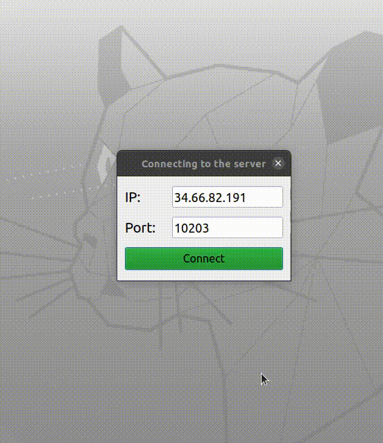

# Remote-execution-project

Execute your program code in a container on a running remote server using a user-friendly interface.

# Implementation

The client and server are implemented using __"Python"__.
Interaction with the server is carried out using socket interfaces (the Python __"socket"__ module), which establishes a connection at the transport layer using the __"TCP" protocol__ and the __"IP" protocol__ at the network layer.
The interface of the client application is implemented using the __"PyQt"__ library.

After the client forms a set of files with the source code of the program and describes the control script, the data is sent to the server and the control script is executed in the __Docker container__. Base container image: __ubuntu:20.04__ with pre-installed Python components and updated package index files ("/bin/bash: apt update").

# Quick demonstration

